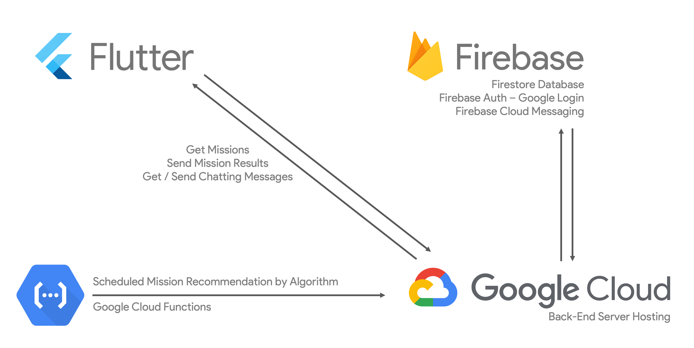

# Project Wiro

App-based Platform to reduce the incidence of lonely deaths.

---

## Problem Statement

South Korea is confronting a significant problem of lonely death among seniors live alone,
which is expected to worsen due to issues like aging society.

Through Our in-depth research we found that elderly individuals
who live alone are dealing with several issues in their daily lives.

We took 3rd and 11th SDGs to deal with this society problem.

The Wiro App sends two notifications with Mission or CheckList each day, tracking the user's responses to ensure
they are staying in touch with.
If a user fails to communicate with app for certain amount of time,
an SOS message is automatically sent to their family, caregivers, or hospital,
thus preventing potential tragedies.

---

## High-Level Architecture Diagram

</img>

[Flutter Application Repository](https://github.com/GDSC-CAU/Solution-Challenge-Team-2-Flutter-App)

[Back-End Repository](https://github.com/GDSC-CAU/Solution-Challenge-Team-2-Spring-BE)

---

## Get Started

#### Required

- Android SDK
- Android Studio
- Flutter SDK

1. Clone this Project

```shell
git clone git@github.com:GDSC-CAU/Solution-Challenge-Team-2-Flutter-App.git
```

2. Open Project with Android Studio

3. Flutter Pub Get

```shell
flutter pub get
```

4. Buil with Android Studio & Enjoy!

---

## Team Info

- Yongmin Yoo (유용민)
  - GDSC CAU 22-23 Core Member
  - Team Leader / Flutter Application / Firebase Firestore
  - [Github](https://github.com/yymin1022)

---

- Sangwoo Shin (신상우)
  - GDSC CAU 22-23 Member
  - Back-End / GCP Hosting / Firebase Firestore
  - [Github](https://github.com/sangwoonoel)

---

- Seunghoon Lee (이승훈)
  - GDSC CAU 22-23 Member
  - DeepLearning / GCP Cloud Functions / Firebase Cloud Messaging
  - [Github](https://github.com/sicmokil)